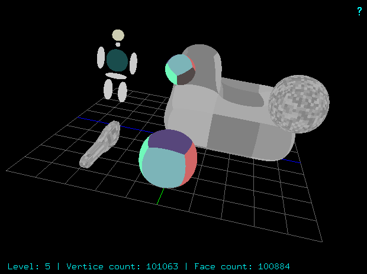

# iztech-ceng487-assignment-5




```text
======== Catmull Clark Subdivision ========
 ECube               	L1	0.00s
 ECube2              	L1	0.00s
 Tori                	L1	0.02s
 HumanoidQuad        	L1	0.03s
===========================================

======== Catmull Clark Subdivision ========
 ECube               	L2	0.01s
 ECube2              	L2	0.01s
 Tori                	L2	0.08s
 HumanoidQuad        	L2	0.10s
===========================================

======== Catmull Clark Subdivision ========
 ECube               	L3	0.05s
 ECube2              	L3	0.05s
 Tori                	L3	0.36s
 HumanoidQuad        	L3	0.53s
===========================================

======== Catmull Clark Subdivision ========
 ECube               	L4	0.23s
 ECube2              	L4	0.23s
 Tori                	L4	2.36s
 HumanoidQuad        	L4	3.89s
===========================================

======== Catmull Clark Subdivision ========
 ECube               	L5	1.38s
 ECube2              	L5	1.39s
 Tori                	L5	28.18s
 HumanoidQuad        	L5	47.54s
===========================================

```